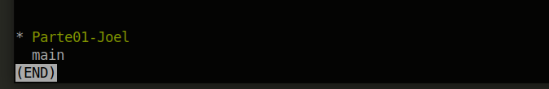
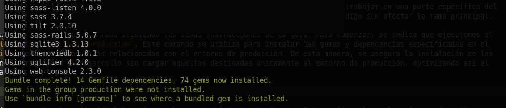
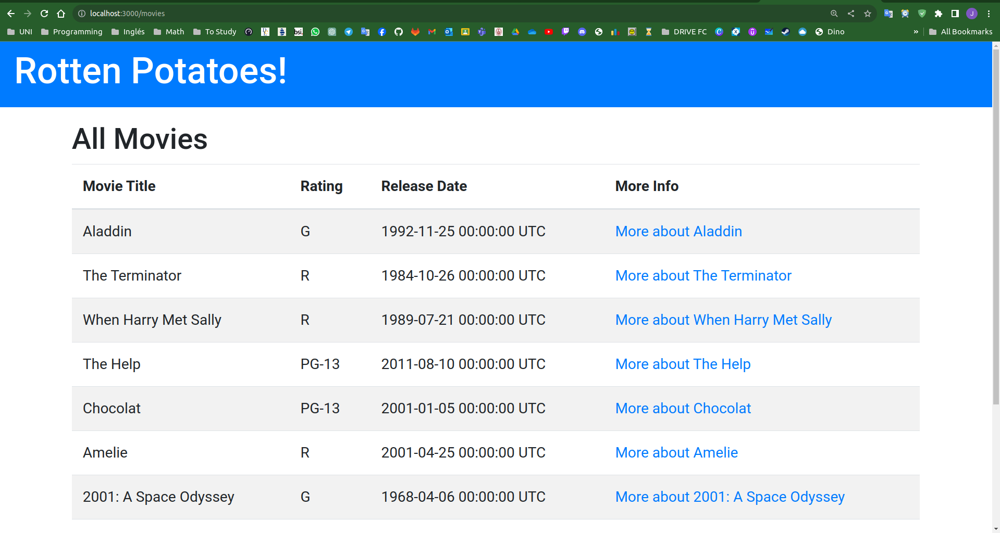

# PC03-CC3S2-Grupo-07
## Tema: Introducción a Rails: Agrega funciones a RottenPotatoes

- Chavez Chico Joel Jhotan 20210058J
- Espinoza Pari Franklin 20210135D
- Pisfil Puicon Angello Jamir 20210035J

## Configuración del Github
Primero vamos a crear nuestro repositorio de trabajo, bajo el nombre de `PC03-CC3S2-Grupo-07`, y vamos a agregar a nuestros colaboradores de proyecto.


Ahora bien, necesitaremos inicializar nuestro proyecto usando el comando git init para establecer un sistema de control de versiones Git en el directorio de nuestro proyecto. Este proceso es crucial para realizar un seguimiento eficiente de los cambios en nuestros archivos a lo largo del tiempo y facilitar la colaboración entre los miembros de nuestro equipo.


Luego vamos a clonar el repositorio sobre el cual trabajaremos el cual se indica en la guía de la práctica.


Una vez hecho esto, ejecutamos `git add` para seleccionar los cambios que queremos incluir en el próximo commit y luego usamos `git commit` para crear un registro permanente de esos cambios con un mensaje descriptivo. Este proceso se repite a medida que desarrollamos, construyendo un historial de versiones estructurado y significativo en nuestro repositorio Git.


Ahora, ejecutamos un `git branch`, para poder crear una nueva rama en nuestro repositorio. Las ramas en Git permiten trabajar en funcionalidades o correcciones por separado, sin afectar la rama principal. Luego, con `git remote`, establecemos conexiones con repositorios remotos, como GitHub, para facilitar la colaboración y compartir nuestro código. Finalmente, al usar `git push`, subimos nuestros commits al repositorio remoto, asegurando que otros colaboradores puedan acceder a nuestros cambios y mantener una versión actualizada del proyecto. Este conjunto de comandos respalda un flujo de trabajo colaborativo y eficiente en el desarrollo de software.


Una vez establecida la infraestructura inicial de nuestro proyecto, procederemos con la ramificación del repositorio. Esta fase implica la creación de ramas específicas para cada integrante del equipo, dividiendo el desarrollo en partes distintas. Crearemos nuestra primera rama como se muestra a continuación:





Usando el `git branch Parte01-Joel` pudimos crear una nueva rama llamada `Parte01-Joel`. Luego, se realiza un cambio a esta nueva rama con el comando `git checkout Parte01-Joel`. Este proceso establece una rama separada para trabajar en una parte específica del proyecto, permitiendo a "Joel" realizar cambios y commits de manera aislada en esa parte del código sin afectar la rama principal.

Ahora bien, vamos a trabajar en esta rama siguiendo las demás instrucciones de la guía. Para comenzar, se indica que ejecutemos el comando `bundle install --without production`. Este comando se utiliza para instalar las gemas y dependencias especificadas en el archivo `Gemfile`, excluyendo aquellas relacionadas con el entorno de producción. De esta manera, se asegura la instalación de las dependencias necesarias para el desarrollo sin cargar aquellas destinadas únicamente al entorno de producción, optimizando así el entorno de trabajo.





Finalmente, ejecutamos la migración inicial mediante el comando bin/rake db:migrate. Esta acción, al ser la primera migración, también implica la creación de la base de datos. El comando se encarga de aplicar las migraciones definidas en el proyecto, estableciendo la estructura inicial de la base de datos de acuerdo con las especificaciones proporcionadas en los archivos de migración.


**Pregunta**: ¿Cómo decide Rails dónde y cómo crear la base de datos de desarrollo? (Sugerencia: verifica los subdirectorios db y config)

**Respuesta**
Rails utiliza la configuración del archivo config/database.yml para determinar dónde y cómo crear la base de datos de desarrollo. En este archivo, podemos encontrar configuraciones para diferentes entornos, como desarrollo, prueba y producción. Por defecto, las configuraciones para el entorno de desarrollo se encuentran bajo la clave development.


**Pregunta**: ¿Qué tablas se crearon mediante las migraciones?

**Respueta:**
La migración `20150809022253_create_movies.rb` crea la tabla `Movies` en la base de datos. Esta tabla contendrá la información relacionada con las películas. Al ejecutar la migración, se establecen las columnas y sus tipos de datos correspondientes, definiendo así la estructura de la tabla. Los detalles específicos de la tabla `Movies` estarán definidos en el contenido de la migración, como por ejemplo, los campos para el título de la película, la fecha de lanzamiento, el director, y cualquier otro atributo relevante.

Ahora vamos a insertar *datos semilla* en la BD, mediante el comando `rake db:seed`.


**Pregunta** ¿Qué datos de semilla se insertaron y dónde se especificaron? (Pista: rake -T db:seed explica la tarea de semilla, rake -T explica otras tareas de Rake disponibles)

En el archivo `/db/seeds.rb`, se especifican los datos de semilla que se insertarán en la base de datos cuando se ejecute el comando `rake db:seed`. Este archivo contiene una serie de hashes que representan películas con sus respectivos atributos, como título, clasificación y fecha de lanzamiento. Aquí, se están creando registros para películas como 'Aladdin', 'The Terminator', 'When Harry Met Sally', entre otras.
```rb
# This file should contain all the record creation needed to seed the database with its default values.
# The data can then be loaded with the rake db:seed (or created alongside the db with db:setup).
#
# Examples:
#
#   cities = City.create([{ name: 'Chicago' }, { name: 'Copenhagen' }])
#   Mayor.create(name: 'Emanuel', city: cities.first)

movies = [{:title => 'Aladdin', :rating => 'G', :release_date => '25-Nov-1992'},
    	  {:title => 'The Terminator', :rating => 'R', :release_date => '26-Oct-1984'},
    	  {:title => 'When Harry Met Sally', :rating => 'R', :release_date => '21-Jul-1989'},
      	  {:title => 'The Help', :rating => 'PG-13', :release_date => '10-Aug-2011'},
      	  {:title => 'Chocolat', :rating => 'PG-13', :release_date => '5-Jan-2001'},
      	  {:title => 'Amelie', :rating => 'R', :release_date => '25-Apr-2001'},
      	  {:title => '2001: A Space Odyssey', :rating => 'G', :release_date => '6-Apr-1968'},
      	  {:title => 'The Incredibles', :rating => 'PG', :release_date => '5-Nov-2004'},
      	  {:title => 'Raiders of the Lost Ark', :rating => 'PG', :release_date => '12-Jun-1981'},
      	  {:title => 'Chicken Run', :rating => 'G', :release_date => '21-Jun-2000'},
  	 ]

movies.each do |movie|
  Movie.create!(movie)
end
```

Cada hash dentro del arreglo `movies` representa un conjunto de datos para una película específica. La tarea de semilla (`rake db:seed`) utiliza estos datos para poblar la base de datos con valores iniciales. La estructura del archivo de semilla permite la creación eficiente de registros en la base de datos cuando sea necesario inicializarla con datos predefinidos. En resumen, al ejecutar `rake db:seed`, se insertarán estos datos en la tabla correspondiente de la base de datos, proporcionando un conjunto inicial de registros para trabajar en la aplicación.

Muy bien ahora vamos a desplegar nuestra app para poder visualizarla en nuestra máquina local, con ayuda del comando `rails server`


Se puede observar que se ha iniciado el servidor de desarrollo de Rails. Al arrancar, el servidor informa que está utilizando WEBrick como servidor web y que la aplicación Rails 4.2.11 está en ejecución en el entorno de desarrollo. La aplicación estará disponible para su visualización en la dirección http://localhost:3000, así que nos dirigimos a dicho puerto desde el navegador para poder observar.



## Despliegue inicial de Heroku / Render
@Angello


## Parte 1: filtrar la lista de películas por clasificación

En esta primera parte, se procede a crear la sección de filtrado en el formulario, realizando modificaciones en el archivo `index.html.erb`. El código agregado introduce un formulario que incluye casillas de verificación para cada clasificación MPAA disponible. Estas casillas permitirán al usuario filtrar la lista de películas según sus preferencias de clasificación.

```html
<!--  This file is app/views/movies/index.html.erb -->
<h2>All Movies</h2>

<%= form_tag movies_path, method: :get, id: 'ratings_form' do %>
  <div class="form-group">
    <%= label_tag 'Include:' %>
    <% Movie.all_ratings.each do |rating| %>
      <div class="form-check form-check-inline">
        <%= label_tag "ratings[#{rating}]", rating, class: 'form-check-label' %>
        <%= check_box_tag "ratings[#{rating}]", "1", @ratings_to_show.nil? ? true : @ratings_to_show.include?(rating), class: 'form-check-input' %>
      </div>
    <% end %>
  </div>
  <%= submit_tag 'Refresh', id: 'ratings_submit', class: 'btn btn-primary' %>
<% end %>


<table class="table table-striped col-md-12" id="movies">
  <thead>
    <tr>
      <th>Movie Title</th>
      <th>Rating</th>
      <th>Release Date</th>
      <th>More Info</th>
    </tr>
  </thead>
  <tbody>
    <% @movies.each do |movie| %>
      <tr>
        <td>
          <%= movie.title %>
        </td>
        <td>
          <%= movie.rating %>
        </td>
        <td>
          <%= movie.release_date %>
        </td>
        <td>
          <%= link_to "More about #{movie.title}", movie_path(movie) %>
        </td>
      </tr>
    <% end %>
  </tbody>
</table>
<%= link_to 'Add new movie', new_movie_path, :class => 'btn btn-primary' %>
```
Las casillas de verificación se generan dinámicamente a partir de las clasificaciones disponibles en el modelo `Movie`. El formulario también incluye un botón "Refresh" que, al ser presionado, actualizará la lista de películas según las clasificaciones MPAA seleccionadas.

Es importante destacar que el código proporcionado utiliza `form_tag` y `check_box_tag` para generar el formulario y las casillas de verificación de manera adecuada. Además, se implementa lógica condicional para asegurar que las casillas de verificación estén inicialmente marcadas cuando el usuario visita la página por primera vez. Este formulario establece la base para la implementación del filtrado dinámico de películas basado en las clasificaciones MPAA seleccionadas por el usuario.

Sin embargo aún hay detalles que falta cambiar, es así en movie.rb (app/models/movie.rb), definimos un método de clase all_ratings en el modelo Movie. Este método devuelve un array con todas las clasificaciones posibles ('G', 'PG', 'PG-13', 'R'). Este método se convierte en un método de clase porque se llama directamente en la clase Movie y no en una instancia de la clase. 

```rb
# app/models/movie.rb
class Movie < ActiveRecord::Base
  def self.all_ratings
    # Devuelve un array con todas las clasificaciones posibles
    ['G', 'PG', 'PG-13', 'R']
  end
end
```

Luego, en movies_controller.rb, específicamente en la acción index, asignas la variable de instancia @all_ratings con el resultado de llamar al método all_ratings del modelo Movie. Esta variable se utilizará en la vista para generar las casillas de verificación del formulario de filtrado.

```RB
# app/controllers/movies_controller.rb
def index
  @movies = Movie.all
  @all_ratings = Movie.all_ratings
end
```

Ahora, en nuestra vista `index.html.erb`, el formulario utiliza `@all_ratings` para generar dinámicamente las casillas de verificación. Esto permite que el usuario seleccione las clasificaciones MPAA con las cuales desea filtrar la lista de películas.

**Pregunta**: ¿Por qué el controlador debe configurar un valor predeterminado para @ratings_to_show incluso si no se marca nada?

**Respuesta**:
El controlador debe configurar un valor predeterminado para `@ratings_to_show` incluso si no se marca nada porque este valor determina si las casillas de verificación deben mostrarse como marcadas o no en la vista. La documentación de Rails para `check_box_tag` indica que el tercer valor, que en este caso es `@ratings_to_show.include?(rating)`, evalúa si la casilla de verificación debe mostrarse marcada.

Si no se configura un valor predeterminado para `@ratings_to_show`, y el usuario no ha marcado ninguna casilla previamente, `@ratings_to_show` sería `nil`. En este caso, al evaluar `nil.include?(rating)` en la vista, se produciría un error, ya que `nil` no es una colección enumerable.

Al configurar un valor predeterminado, como incluir todas las clasificaciones posibles ('G', 'PG', 'PG-13', 'R'), se garantiza que, incluso si el usuario no ha marcado ninguna casilla, `@ratings_to_show` sea una colección válida y la evaluación `@ratings_to_show.include?(rating)` sea segura en la vista. Esto permite que, al presionar el botón "Refresh" sin seleccionar ninguna clasificación específica, se muestren todas las películas y se marquen todas las casillas de verificación por defecto.


Hasta el momento, hemos observado que la aplicación no implementa correctamente la funcionalidad de filtrado; aunque los botones de clasificación están presentes, no tienen un impacto real. Para corregir esto, se han realizado modificaciones sustanciales tanto en la clase controladora como en el modelo movie.rb. A continuación, se detallan los cambios realizados para abordar esta situación.

```ruby
# app/controllers/movies_controller.rb
def index
  # Obtener todas las películas o filtrar por calificaciones seleccionadas
  @movies = params[:ratings] ? Movie.with_ratings(params[:ratings].keys) : Movie.all

  # Configurar las clasificaciones seleccionadas para que las casillas de verificación se muestren como marcadas
  @ratings_to_show = params[:ratings]&.keys

  # Obtener todas las clasificaciones posibles para construir las casillas de verificación
  @all_ratings = Movie.all_ratings
end 
```

1. `@movies = params[:ratings] ? Movie.with_ratings(params[:ratings].keys) : Movie.all`: Aquí se determina si el usuario ha seleccionado alguna clasificación utilizando las casillas de verificación. Si se han seleccionado clasificaciones, se filtran las películas usando el método `with_ratings` del modelo `Movie`; de lo contrario, se obtienen todas las películas.

2. `@ratings_to_show = params[:ratings]&.keys`: Esta línea configura las clasificaciones seleccionadas para que las casillas de verificación se muestren como marcadas. Se utiliza el operador `&.` para manejar el caso en que `params[:ratings]` es `nil`.

3. `@all_ratings = Movie.all_ratings`: Se obtienen todas las clasificaciones posibles para construir las casillas de verificación en el formulario.

```ruby
# app/models/movie.rb
class Movie < ActiveRecord::Base
  
  def self.with_ratings(ratings_list)
    return all if ratings_list.nil? || ratings_list.empty?

    where(rating: ratings_list)
  end

  def self.all_ratings
    ['G', 'PG', 'PG-13', 'R']
  end
end
```

1. `self.with_ratings(ratings_list)`: Este método de clase en el modelo `Movie` recibe una lista de clasificaciones y devuelve una relación ActiveRecord que contiene las películas cuyas clasificaciones coinciden con las clasificaciones de la lista. Si la lista es `nil` o está vacía, se devuelven todas las películas.

2. `self.all_ratings`: Este método de clase devuelve un array con todas las clasificaciones posibles ('G', 'PG', 'PG-13', 'R').

## Parte 2: Ordenar la lista de películas

